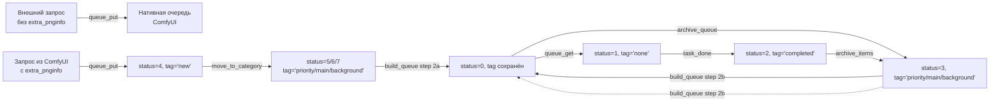

# Архитектура очереди ComfyUI Queue Manager

## 1. Архитектура

Queue Manager — кастомный extension для ComfyUI, который полностью перехватывает (hijack) нативную очередь и управляет ей через свою БД SQLite. Основные компоненты:

- [`QueueManager`](../src/comfyui_queue_manager/queue_manager.py:10) — точка входа, инициализирует БД, опции, очередь и сервер
- [`QM_Queue`](../src/comfyui_queue_manager/qm_queue.py:16) — ядро: управление очередью, перехват нативных методов
- [`QM_Server`](../src/comfyui_queue_manager/qm_server.py:12) — HTTP API эндпоинты
- [`qm_db.py`](../src/comfyui_queue_manager/qm_db.py) — слой доступа к SQLite

---

## 2. Статусы (поле `status` в БД)

Числовое поле в таблице [`queue`](../src/comfyui_queue_manager/qm_db.py:29), определяющее жизненный цикл задачи:

| Статус | Значение | Описание |
|--------|----------|----------|
| **0** | `pending` | Ожидает выполнения |
| **1** | `running` | Выполняется сейчас |
| **2** | `completed` | Успешно завершена |
| **3** | `archive` | Архивирована (снята с очереди, но сохранена) |
| **4** | `new` | Новая задача, ожидает категоризации |
| **5** | `priority` | Категория "Приоритет" |
| **6** | `main` | Категория "Основные" |
| **7** | `background` | Категория "Фоновые" |

---

## 3. Теги (поле `tag`)

Текстовое поле с CHECK-ограничением [`VALID_TAGS`](../src/comfyui_queue_manager/qm_queue.py:12):

```python
VALID_TAGS = {"none", "new", "main", "priority", "background", "archive", "completed"}
DEFAULT_TAG = "none"
```

Теги синхронизированы со статусами. Используются для сортировки при сборке очереди (см. раздел 6).

---

## 4. Жизненный цикл задачи



### 4.1 Добавление задачи ([`queue_put`](../src/comfyui_queue_manager/qm_queue.py:206))

Когда пользователь нажимает "Queue Prompt" в ComfyUI:

1. Вызывается перехваченный метод [`queue_put`](../src/comfyui_queue_manager/qm_queue.py:206).
2. Если у задачи нет `extra_pnginfo.workflow` (внешний API-запрос) — отправляется напрямую в нативную очередь ComfyUI, Queue Manager не отслеживает.
3. Если `extra_pnginfo` есть — задача вставляется в БД со **статусом 4 (`new`)** и **тегом `'new'`**.
4. Если нативная очередь пуста и очередь не на паузе — задача с наивысшим приоритетом из БД (status=0) отправляется в нативную очередь.
5. Если в нативной очереди уже есть задачи — шлётся уведомление фронтенду через `queue_updated()`.

**Важно**: Новая задача (status=4) **не попадает** в очередь выполнения автоматически. Она ждёт, пока пользователь назначит ей категорию.

### 4.2 Назначение категории ([`move_to_category`](../src/comfyui_queue_manager/qm_queue.py:576))

Через API `/queue_manager/move-to-category` пользователь перемещает задачу из `new` (status=4) в одну из категорий:

- **priority** → status=5, tag=`'priority'`
- **main** → status=6, tag=`'main'`
- **background** → status=7, tag=`'background'`

Задача всё ещё **не попадает в очередь выполнения**. Она ждёт кнопку **Build Queue**.

### 4.3 Build Queue ([`build_queue`](../src/comfyui_queue_manager/qm_queue.py:778))

Ключевой механизм. При нажатии кнопки "Build Queue" происходит двухшаговый процесс:

**Шаг 1** ([`_build_queue_step1_archive_pending`](../src/comfyui_queue_manager/qm_queue.py:645)): Все текущие pending задачи (status=0) архивируются → status=3. **Теги сохраняются** как есть.

**Шаг 2** ([`_build_queue_step2_process_tiers`](../src/comfyui_queue_manager/qm_queue.py:661)): Обработка приоритетных уровней. Для каждого уровня (priority → main → background) выполняются два подшага:

  a. Задачи из категории (status 5/6/7) → status=0 (`pending`), тег сохраняется.
  b. Задачи из архива (status=3) с соответствующим тегом → status=0 (`pending`), тег сохраняется.

Порядок обработки:

1. **Priority**: сначала задачи из категории (status=5), затем из архива с тегом `priority`
2. **Main**: сначала задачи из категории (status=6), затем из архива с тегом `main`
3. **Background**: сначала задачи из категории (status=7), затем из архива с тегом `background`

Внутри каждой группы — по `updated_at`.

**Результат**: В архиве (status=3) остаются только задачи с тегами `archive`, `none`, `new`, `completed`. Все задачи с тегами `priority`, `main`, `background` перемещаются в очередь выполнения.

### 4.4 Выполнение ([`queue_get`](../src/comfyui_queue_manager/qm_queue.py:261))

1. Если очередь на паузе — `queue_get` блокируется на `pause_lock` и ждёт.
2. Если в нативной очереди нет элементов — берётся задача с наименьшим `number` (наивысший приоритет) из БД со status=0.
3. Задача помещается в нативную очередь через `heapq.push`.
4. Вызывается оригинальный `get()`.
5. Когда задача получена — её статус в БД меняется на **1 (`running`)**.

### 4.5 Завершение ([`task_done`](../src/comfyui_queue_manager/qm_queue.py:179))

Когда ComfyUI завершает выполнение:

1. Статус задачи в БД меняется на **2 (`completed`)**, тег — `'completed'`.
2. Вызывается оригинальный `task_done` ComfyUI.

### 4.6 Архивация

- **`archive_queue`** ([`qm_queue.py:389`](../src/comfyui_queue_manager/qm_queue.py:389)): Все pending задачи (status=0) → status=3, tag=`'archive'`. Нативная очередь очищается.
- **`archive_items`** ([`qm_queue.py:417`](../src/comfyui_queue_manager/qm_queue.py:417)): Конкретные задачи по ID → status=3, tag=`'archive'`.

### 4.7 Восстановление из архива

- **`play_items`** ([`qm_queue.py:455`](../src/comfyui_queue_manager/qm_queue.py:455)): Конкретные archived задачи → status=0 с новым номером. Можно поставить в начало очереди (`front=true`).
- **`play_archive`** ([`qm_queue.py:525`](../src/comfyui_queue_manager/qm_queue.py:525)): Все archived задачи → status=0.

---

## 5. Взаимодействие статусов и тегов

| Действие | Статус | Тег |
|----------|--------|------|
| Добавление задачи | 4 (`new`) | `'new'` |
| Move to Priority | 5 | `'priority'` |
| Move to Main | 6 | `'main'` |
| Move to Background | 7 | `'background'` |
| Build Queue (из категории) | 0 (`pending`) | сохраняется (`priority`/`main`/`background`) |
| Build Queue (из архива с тегом) | 0 (`pending`) | сохраняется (`priority`/`main`/`background`) |
| Начало выполнения | 1 (`running`) | `'none'` |
| Завершение | 2 (`completed`) | `'completed'` |
| Архивация | 3 (`archive`) | `'archive'` |

**Ключевое правило Build Queue**: В архиве (status=3) после сборки остаются только задачи с тегами `archive`, `none`, `new`, `completed`. Все задачи с тегами `priority`, `main`, `background` перемещаются в очередь выполнения (status=0) с сохранением тега.

---

## 6. Механизм паузы ([`toggle_playback`](../src/comfyui_queue_manager/qm_queue.py:328))

- При паузе: нативная очередь очищается, `paused=true`, `pause_lock` блокирует `queue_get`.
- При возобновлении: `pause_lock.notify()` пробуждает ожидающие потоки.

---

## 7. Восстановление после перезапуска ([`restore_queue`](../src/comfyui_queue_manager/qm_queue.py:898))

При старте сервера:

1. Все задачи со status=1 (`running`) сбрасываются в status=0 с наивысшим приоритетом.
2. Счётчик задач (`task_counter`) восстанавливается из БД.
3. Вызывается `queue_get()` для запуска обработки.

---

## 8. Ключевая особенность: два уровня очередей

Queue Manager использует **два уровня**:

1. **SQLite БД** — хранит все задачи со статусами и тегами. Это "источник истины".
2. **Нативная очередь ComfyUI** (`heapq`) — содержит только **один элемент** (или пуста). Это оптимизация: вместо того чтобы пихать тысячи задач в нативную очередь (что вызывает лаги), Queue Manager подкладывает задачи по одной по мере выполнения.

Это видно в [`queue_get`](../src/comfyui_queue_manager/qm_queue.py:269): если нативная очередь пуста — берётся следующая задача из БД.

---

## 9. Схема БД

Таблица [`queue`](../src/comfyui_queue_manager/qm_db.py:20-31):

```sql
CREATE TABLE IF NOT EXISTS queue (
    id          INTEGER PRIMARY KEY AUTOINCREMENT,
    prompt_id   VARCHAR(255) NOT NULL UNIQUE,
    created_at  DATETIME DEFAULT CURRENT_TIMESTAMP,
    updated_at  DATETIME DEFAULT CURRENT_TIMESTAMP,
    number      INTEGER,
    name        TEXT,
    workflow_id VARCHAR(255),
    prompt      TEXT,
    status      INTEGER DEFAULT 0,  -- 0: pending, 1: running, 2: finished, 3: archive, 4: new, 5: priority, 6: main, 7: background
    tag         TEXT DEFAULT 'none' CHECK(tag IN ('none', 'new', 'main', 'priority', 'background', 'archive', 'completed'))
);
```

Индекс по `(status, number)` для быстрой выборки следующей задачи. Триггер `queue_set_updated_at` автоматически обновляет `updated_at` при изменениях.
