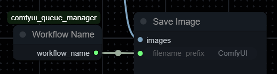

Emits the currently running workflow's name.

### Usage:
Drop Workflow Name node into your workflow and connect `workflow_name` output to a node that accepts a string as inpout.

### Use case:
Connect `workflow_name` output to a **Save Image**'s `filename_prefix` input to have output images saved with the workflow's name as a prefix.

### Outputs:

| Name            | Type     | Description                       |
|-----------------|----------|-----------------------------------|
| `workflow_name` | `STRING` | Currently running workflow's name |
